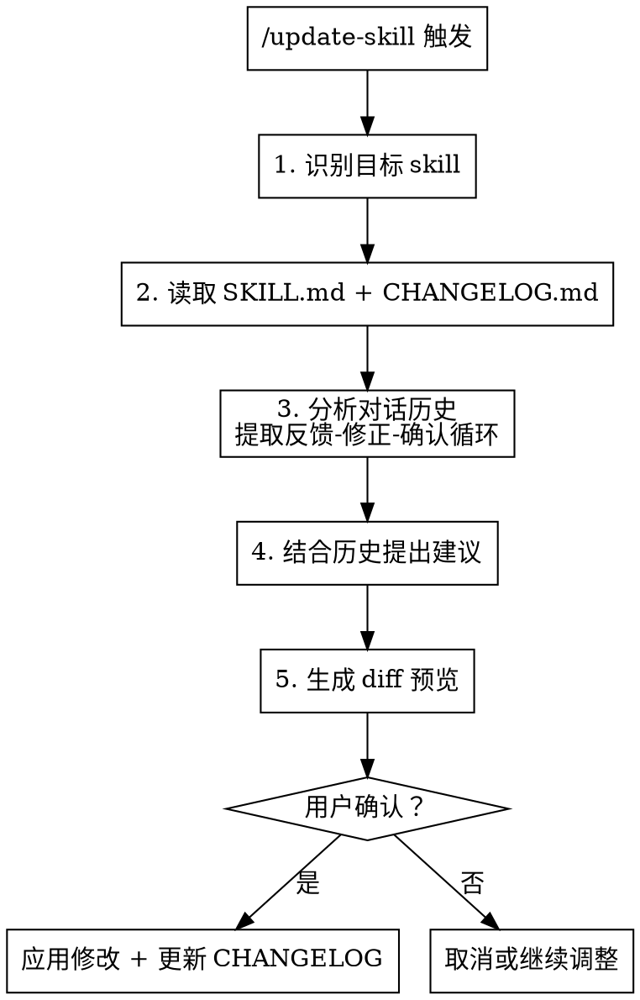

# Skill Iterator

根据对话中的反馈自动迭代更新 skill。

## 触发方式

- `/update-skill` — 更新当前对话使用的 skill
- `/update-skill <skill-name>` — 更新指定的 skill
- `/feedback <内容>` — 显式标记重要反馈（可选，会被优先处理）

## 工作流程



## 反馈识别

### 完整的反馈循环

不要只看用户说"不对"，要分析完整的循环：

```
用户反馈 → AI 修正 → 用户确认/继续修改
```

**提取规则：**

| 对话片段 | 提取内容 |
|---------|---------|
| 用户反馈 | 问题是什么（触发点） |
| AI 修正回复 | 正确做法是什么（解决方案） |
| 用户确认（"好"、"对"、继续下一步） | 这个修正被接受 ✓ |
| 用户继续修改 | 追踪后续循环，直到确认 |

**示例：**
```
用户："字体太小了"          → 问题：字体大小
AI："好的，改成24pt"        → 方案：24pt
用户："再大一点"            → 未确认，继续
AI："改成32pt"              → 新方案：32pt
用户："好"                  → 确认 ✓
─────────────────────────────
最终提取：字体应该用 32pt
```

### 自动识别的反馈类型

| 类型 | 识别特征 |
|------|---------|
| 纠错 | "不对"、"错了"、"应该是..."、"这样不行" |
| 补充 | "还需要..."、"漏了..."、"加上..."、"别忘了..." |
| 偏好 | "我更喜欢..."、"别用..."、"换成..."、"不要..." |
| 流程 | "先做...再做..."、"跳过这步"、"顺序反了" |

### 显式标记

用户使用 `/feedback` 标记的内容优先级更高：
```
/feedback 每次生成前必须先确认风格
```

## 反馈归类

将提取的反馈映射到 SKILL.md 的对应部分：

| 反馈内容 | 映射到 |
|---------|--------|
| 使用时机相关 | When to Use |
| 流程/步骤相关 | Overview / The Process |
| 具体操作/实现 | Implementation / Steps |
| 出错/踩坑相关 | Common Mistakes |

## Diff 展示格式

```markdown
## 📝 Skill 更新建议

**目标文件**：<skill-path>/SKILL.md

**本次对话收集到 N 条有效反馈：**
1. 反馈描述（来自第 X-Y 轮对话）
2. 反馈描述（来自 /feedback 标记）

---

### 修改 1：<章节名>

```diff
- 原文内容
+ 新文内容
```

---

### 修改 2：<章节名>（新增）

```diff
+ 新增内容
```

---

⚠️ 历史提醒：<如有相关历史提醒则显示>

---

确认应用这些修改？[Y/n]
```

## 修改历史

### 文件位置

skill 可能位于以下位置：
- `~/.claude/skills/<skill-name>/` — 独立 skills
- `~/.claude/plugins/cache/<marketplace>/<plugin>/<version>/skills/<skill-name>/` — 插件中的 skills

```
{skill-directory}/
    SKILL.md           # 主文件
    CHANGELOG.md       # 修改历史
```

### CHANGELOG.md 格式

```markdown
# <skill-name> 修改历史

## YYYY-MM-DD - 第 N 次迭代

**反馈来源**：对话简述

**修改内容**：
1. [章节名] 修改描述
2. [章节名] 修改描述

**修改原因**：
- 原因 1
- 原因 2

---
```

### 智能建议

读取 CHANGELOG.md 后，检测以下模式并提醒用户：

| 模式 | 建议 |
|-----|------|
| 同一部分被反复修改（≥3次） | "这是第 N 次修改 X，建议增加专门章节或检查清单" |
| 改过又改回来 | "注意：这个设置在 MM-DD 改成 A，后来改回 B，确认这次要改吗？" |
| 某类反馈频率高（>50%） | "历史上多数反馈都关于 X，考虑重构这部分？" |

## 执行步骤

当用户触发 `/update-skill` 时：

1. **识别目标 skill**
   - 如果指定了 skill 名称，使用指定的
   - 否则，从对话历史中找到本次使用的 skill（查找 `<command-name>` 标记或 Skill 工具调用）

2. **读取文件**
   - 根据 skill 名称查找对应目录（先查插件目录，再查独立 skills 目录）
   - 读取 `SKILL.md` 和 `CHANGELOG.md`（如果存在）

3. **分析对话历史**
   - 遍历对话，找到所有反馈-修正-确认循环
   - 提取 `/feedback` 显式标记
   - 记录每个反馈的对话轮次（用于展示来源）

4. **结合历史分析**
   - 如果 CHANGELOG.md 存在，读取并分析修改模式
   - 生成智能建议

5. **生成 diff 预览**
   - 按照展示格式输出
   - 包含历史提醒（如有）

6. **等待用户确认**
   - 确认：应用修改到 SKILL.md，追加记录到 CHANGELOG.md
   - 拒绝：询问需要调整什么，或取消操作

## 注意事项

- **最小化修改**：只改需要改的部分，保持其他内容不变
- **保留风格**：匹配原文件的格式、语气、结构
- **不要臆测**：只根据确认的反馈循环修改，不要添加用户没提到的内容
- **CHANGELOG 必须更新**：每次修改都要记录，这是迭代改进的基础
